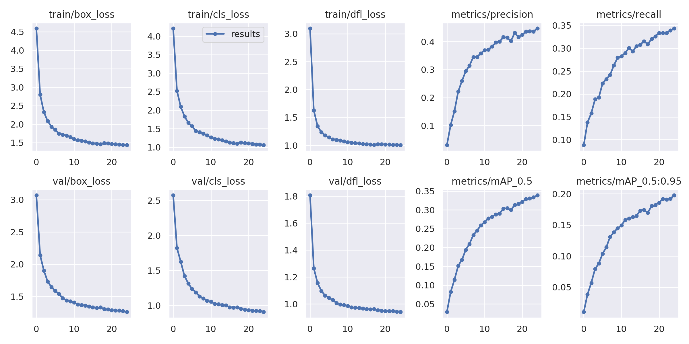
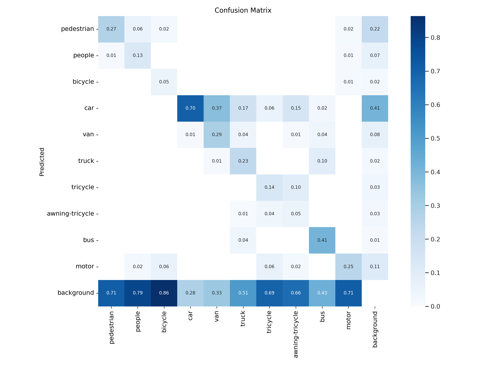

# Yolov9-on-VisDrone-dataset
This a simple comparison and benefits of the pre-trained weights model vs the random weights model


##### Group members:
1. https://github.com/AM172-ce
2. https://github.com/mahyar6pari

The Second project of Artificial Intelligence spring 2024

Professor: [Dr. Afsharchi](http://cv.znu.ac.ir/afsharchim/)
### Implementation report: YOLOv9 model training

#### Overview

This report details the steps taken to train the model (YOLOv9) for object detection, using pre-trained weights and training with random weights. This project includes setting up the environment, downloading the necessary dependencies, preparing the data set and implementing the training process.

## 1. Setting Up the Environment

### Part One:

The first step involves setting up the environment in Colab Google and mounting Google Drive to access the files.

```python
from google.colab import drive
drive.mount('/content/drive')
```

This code mounts Google Drive on Colab to enable saving model outputs directly to Drive.

- Installing Dependencies

Required library installation. In this section, to download the output file through the share with me section of the drive. which is due to GPU limitations; We had to keep practicing between multiple Google accounts. For this purpose, in this section, the half-finished file of the previous account can be downloaded again in the notebook of the new account.

```python
!pip install -U -q Pydrive2
```

- Authenticate and launch Google Drive


```python
from pydrive2.auth import GoogleAuth
from pydrive2.drive import GoogleDrive
from google.colab import auth
from oauth2client.client import GoogleCredentials

# Authenticate and create the PyDrive client.
auth.authenticate_user()
gauth = GoogleAuth()
gauth.credentials = GoogleCredentials.get_application_default()
drive = GoogleDrive(gauth)
```

- Download data from Google Drive

A function is defined to list and download files from a specified Google Drive folder.

```python
import os

def list_files_in_folder(folder_id):
 """List all files in the given folder ID."""
 query = f"'{folder_id}' in parents and trashed=false"
 file_list = drive.ListFile({'q': query}).GetList()
 return file_list

def download_folder(folder_id, local_path):
 """Download all files and folders from Google Drive folder to local path."""
 os.makedirs(local_path, exist_ok=True)
 file_list = list_files_in_folder(folder_id)

 for file in file_list:
 file_name = file['title']
 file_id = file['id']
 if file['mimeType'] == 'application/vnd.google-apps.folder':
 # If the file is a folder, recursively download it
 download_folder(file_id, os.path.join(local_path, file_name))
 otherwise:
 # If the file is not a folder, download it
 print(f'Downloading {file_name}...')
 downloaded = drive.CreateFile({'id': file_id})
 downloaded.GetContentFile(os.path.join(local_path, file_name))
 print(f'{file_name} downloaded.')

# Specify the folder ID and local path where you want to save the files
folder_id = 'Replace with your folder ID'
local_path = 'Replace with your desired local path' 

# Download the folder
download_folder(folder_id, local_path)
```
### Part Two:


```python
import os
HOME = os.getcwd()
print(HOME)
```

#### 1. Install YOLOv9 from Git


```python
!git clone https://github.com/SkalskiP/yolov9.git
%cd yolov9
!pip install -r requirements.txt -q
```

#### 2. Download the VisDrone dataset for practice

In this code, dataset files are installed for training and testing the model.

```python
# Create a directory for the dataset
dataset_dir = '/content/datasets/VisDrone'
os.makedirs(dataset_dir, exist_ok=True)

# Download the dataset files
!wget -q --show-progress -O {dataset_dir}/VisDrone2019-DET-train.zip 'https://github.com/ultralytics/yolov5/releases/download/v1.0/VisDrone2019-DET-train.zip '

!wget -q --show-progress -O {dataset_dir}/VisDrone2019-DET-val.zip 'https://github.com/ultralytics/yolov5/releases/download/v1.0/VisDrone2019-DET-val.zip '

!wget -q --show-progress -O {dataset_dir}/VisDrone2019-DET-test-dev.zip 'https://github.com/ultralytics/yolov5/releases/download/v1.0/VisDrone2019-DET-test -dev.zip'

!wget -q --show-progress -O {dataset_dir}/VisDrone2019-DET-test-challenge.zip 'https://github.com/ultralytics/yolov5/releases/download/v1.0/VisDrone2019-DET-test -challenge.zip'

!wget -q --show-progress -O {dataset_dir}/VisDrone2019-VID-test-dev.zip 'https://drive.usercontent.google.com/download?id=1-BEq--FcjshTF1UwUabby_LHhYj41os5&export=download&authuser= 2&confirm=t&uuid=7fc409c3-d13d-4090-b9e9-fc3ac9f1c32f&at=APZUnTW5wbsPMh4woDuW_HNY4uFj%3A1720181545143'
```

Unzip the files

```python
!unzip -q {dataset_dir}/VisDrone2019-DET-train.zip -d {dataset_dir}
!unzip -q {dataset_dir}/VisDrone2019-DET-val.zip -d {dataset_dir}
!unzip -q {dataset_dir}/VisDrone2019-DET-test-dev.zip -d {dataset_dir}
!unzip -q {dataset_dir}/VisDrone2019-DET-test-challenge.zip -d {dataset_dir}
!unzip -q {dataset_dir}/VisDrone2019-VID-test-dev.zip -d {dataset_dir}
```

#### 4. Defining the data yaml file
In this code, you define the yaml file for the dataset so that the classes for the necessary exercise are specified

```python
import os
from pathlib import Path
import yaml

yaml_content = """
# Ultralytics YOLO 🚀, AGPL-3.0 license
# VisDrone2019-DET dataset https://github.com/VisDrone/VisDrone-Dataset by Tianjin University
# Documentation: https://docs.ultralytics.com/datasets/detect/visdrone/
# Example usage: yolo train data=VisDrone.yaml

path: /content/datasets/VisDrone # dataset root dir
train: VisDrone2019-DET-train/images # train images (relative to 'path')
val: VisDrone2019-DET-val/images # val images (relative to 'path')
test: VisDrone2019-DET-test-dev/images # test images (optional)

# Classes
names:

 0: pedestrian
 1: people
 2: bicycle
 3: car
 4: van
 5: truck
 6: tricycle
 7: awning-tricycle
 8: bus
 9: motor
"""

yaml_file_path = '/content/yolov9/data/VisDrone.yaml'
os.makedirs(os.path.dirname(yaml_file_path), exist_ok=True)
with open(yaml_file_path, 'w') as f:
 f.write(yaml_content)
```

#### 5. Script to change annotations

This script ensures that the dataset is properly formatted and ready for training with YOLO models, facilitating accurate and efficient object detection.
```python
from PIL import Image
from tqdm import tqdm

def visdrone2yolo(dir):
 def convert_box(size, box):
 dw = 1. / size[0]
 dh = 1. / size[1]
 return (box[0] + box[2] / 2) * dw, (box[1] + box[3] / 2) * dh, box[2] * dw, box[3] * dh

 (dir / 'labels').mkdir(parents=True, exist_ok=True)

 pbar = tqdm((dir / 'annotations').glob('*.txt'), desc=f'Converting {dir}')

 for f in pbar:

 img_size = Image.open((dir / 'images' / f.name).with_suffix('.jpg')).size

 lines = []

 with open(f, 'r') as file:

 for row in [x.split(',') for x in file.read().strip().splitlines()]:

 if row[4] == '0':

 continue

 cls = int(row[5]) - 1

 box = convert_box(img_size, tuple(map(int, row[:4])))

 lines.append(f"{cls} {' '.join(f'{x:.6f}' for x in box)}\n")

 with open(str(f).replace(f'{os.sep}annotations{os.sep}', f'{os.sep}labels{os.sep}'), 'w') as fl:

 fl.writelines(lines)

for d in ['VisDrone2019-DET-train', 'VisDrone2019-DET-val', 'VisDrone2019-DET-test-dev', 'VisDrone2019-VID-test-dev']:

 visdrone2yolo(Path(dataset_dir) / d)
```
---
## Training with random weight (without weight):

### 1. Train:
- `!python train.py`:
Executes the training script train.py using Python.

- `--batch 8`:
Sets the batch size to 8. This means the model will be updated after processing 8 images at a time.

- `--epochs 25`:
Specifies the number of training epochs. The model will train for 25 complete passes over the entire dataset.

- `--img 640`:
Sets the input image size to 640x640 pixels. All images will be resized to this dimension before being fed into the model.

- `--device 0`:
Specifies the device to use for training. 0 typically refers to the first GPU. If you want to use the CPU, you can set this to cpu.

- `--data /content/yolov9/data/VisDrone.yaml`:
Provides the path to the dataset configuration file (VisDrone.yaml). This file contains information about the dataset, such as the paths to the training and validation sets and the number of classes.

- `--weights'':
Indicates that the model should be trained from scratch, using randomly initialized weights. If you wanted to use pre-trained weights, you would provide the path to the weights file here.

- `--cfg models/detect/gelan-c.yaml`:
Specifies the model configuration file. This file defines the architecture of the YOLO model to be used.

- `--hyp data/hyps/hyp.scratch-high.yaml`:
Points to the hyperparameter configuration file. This file includes various hyperparameters for training, such as learning rate, momentum, etc.

- `--project /content/drive/MyDrive/yolov9_results`:
Sets the directory where the training results (such as weights, logs, and plots) will be saved.

 - `--name visdrone_experiment`:
 Names the specific training run. This name will be used to create a subdirectory under the project directory to store the results of this training run.


This command initiates the training of a YOLOv9 model on the VisDrone dataset with the specified parameters. It sets up the batch size, number of epochs, image size, device, dataset configuration, model configuration, hyperparameters, and directories for saving results. By specifying --weights '', the model is trained from scratch, meaning it starts with randomly initialized weights.

```python
!python train.py --batch 8 --epochs 25 --img 640 --device 0 --data /content/yolov9/data/VisDrone.yaml --weights '' --cfg models/detect/gelan-c. yaml --hyp data/hyps/hyp.scratch-high.yaml --project /content/drive/MyDrive/yolov9_results --name visdrone_experiment
```

### 2. Resume the training

```python
!python train.py --resume /content/drive/MyDrive/yolov9_results/visdrone_experiment4/weights/last.pt
```
### 3. Display the results:
```python
from IPython. display import Image
Image(filename=f"/content/drive/MyDrive/yolov9_results/visdrone_experiment4/results.png", width=1000)
```
<picture>
        <source media="(min-width: 760px)" srcset="./yolov9_results/visdrone_experiment4/results.png">
        
</picture>
  
```python
from IPython. display import Image
Image(filename=f"/content/drive/MyDrive/yolov9_results/visdrone_experiment4/confusion_matrix.png", width=1000)
```
<picture>
        <source media="(min-width: 760px)" srcset="./yolov9_results/visdrone_experiment4/confusion_matrix.png">
        
</picture>


#### The structure of the confusion matrix

- **Rows (Predicted):** Each row represents the predictions made by the model.
- **Columns (True):** Each column represents real classes.
- **Diagonal Elements:** Correct predictions (true positives). For example, the value at the intersection of The cell at (pedestrian, pedestrian) shows a value of 0.27, indicating that 27% of actual pedestrians were correctly identified as pedestrians.
- **Off-Diagonal Elements:** False predictions (false positive or false negative). For example, The value at the intersection of the "car" row and the "background" column is 0.41, revealing that 41% of the "car" predictions were actually background.
#### Key observations

1. **Pedestrian class:**
 - 27% of the predicted "pedestrian" class is correct.
 - Misclassified as "people" (6%) and "background" (22%).

2. **Class of people:**
 - 13% of the predicted "people" class is correct.
 - Misclassified as "pedestrian" (1%) and "background" (79%).

3. **Car class:**
 - 70% of the predicted "Car" class is correct.
 - Misclassified as "van" (17%) and "background" (28%).

4. **Background class:**
 - This class has a high misclassification rate, indicating that the model struggles to distinguish objects from the background. For instance, 71% of the "engine" class projections are actually background.
#### Overall performance

- **Accuracy:** Large values ​​along the diagonal indicate that the model is predicting correctly for a good proportion of the classes.
- **Misclassification:** Large off-diagonal values, especially for the background class, suggest areas where the model can be improved.
#### Result

The confusion matrix shows that while the model performs well on certain classes such as "cars", it struggles with others such as "people" and "background" and suggests areas for further improvements, such as increasing data or tuning meta-parameters.

```python
from IPython. display import Image
Image(filename=f"/content/drive/MyDrive/yolov9_results/visdrone_experiment4/val_batch0_pred.jpg", width=1000)
```
<picture>
        <source media="(min-width: 760px)" srcset="./yolov9_results/visdrone_experiment4/val_batch0_pred.jpg">
        
</picture>

---

### 4. validate

This code validates the YOLOv9 model on the VisDrone dataset using the specified parameters and allows to evaluate the performance of the model.

```python
!python val.py \
--img 640 --batch 15 --conf 0.001 --iou 0.7 --device cpu \
--data /content/yolov9/data/VisDrone.yaml \
--weights /content/drive/MyDrive/yolov9_results/visdrone_experiment4/weights/best.pt \
--project /content/drive/MyDrive/yolov9_results \
--name val_visdrone_test_dev
```

### 5. Detect

#### VisDrone2019-DET-test-dev(images)

```python
!python detect.py --weights /content/drive/MyDrive/yolov9_results/visdrone_experiment4/weights/best.pt --conf 0.25 --source /content/datasets/VisDrone/VisDrone2019-DET-test-dev/images --device cpu --project /content/drive/MyDrive/yolov9_results --name detect_visdrone_test_dev
```

#### VisDrone2019-VID-test-dev(videos)
Here `uav0000009_03358_v' you can put any file address in the video dataset.

```python
!python detect.py --weights /content/drive/MyDrive/yolov9_results/visdrone_experiment4/weights/best.pt --conf 0.25 --source /content/datasets/VisDrone/VisDrone2019-VID-test-dev/sequences/uav0000009_03358_v  - -project /content/drive/MyDrive/yolov9_results --name detect_visdrone_video
```

#### Output video:

```python
!pip install opencv-python
import cv2
import os

image_folder = '/content/drive/MyDrive/yolov9_results/detect_visdrone_video4'
output_path = '/content/drive/MyDrive/yolov9_results/detect_visdrone_video4/video/output_video.mp4'

images = [img for img in os.listdir(image_folder) if img.endswith(".jpg")]
images.sort()
frame = cv2.imread(os.path.join(image_folder, images[0]))
height, width, layers = frame.shape
size = (width, height)

fourcc = cv2.VideoWriter_fourcc(*'mp4v')
out = cv2.VideoWriter(output_path, fourcc, 1, size)

for image in images:
 frame = cv2.imread(os.path.join(image_folder, image))
 out.write(frame)
out.release()

print(f"Video saved at: {output_path}")
```
---
## Training with pre-trained weights (with weight):

### Download weights

```python
!wget -P {HOME}/weights -q https://github.com/WongKinYiu/yolov9/releases/download/v0.1/yolov9-c.pt
!wget -P {HOME}/weights -q https://github.com/WongKinYiu/yolov9/releases/download/v0.1/yolov9-e.pt
!wget -P {HOME}/weights -q https://github.com/WongKinYiu/yolov9/releases/download/v0.1/gelan-c.pt
!wget -P {HOME}/weights -q https://github.com/WongKinYiu/yolov9/releases/download/v0.1/gelan-e.pt
```

```python
!ls -la {HOME}/weights
```

### 1. Train with weight (gelan-c)

```python
!python train.py --batch 8 --epochs 25 --img 640 --device 0 --data /content/yolov9/data/VisDrone.yaml --weights /content/weights/gelan-c.pt --cfg models/detect/gelan-c.yaml --hyp data/hyps/hyp.scratch-high.yaml --project /content/drive/MyDrive/yolov9_results_with_weight --name visdrone_experiment_gelan-c
```

### 2. Resume the training

```python
!python train.py --resume /content/drive/MyDrive/yolov9_results_with_weight/visdrone_experiment_yolov9-c/weights/last.pt
```

### 3. Displaying the results:
```python
from IPython. display import Image
Image(filename=f"/content/drive/MyDrive/yolov9_results_with_weight/visdrone_experiment_gelan-c/results.png", width=1000)
```
<picture>
        <source media="(min-width: 760px)" srcset="./yolov9_results_with_weight/visdrone_experiment_gelan-c/results.png">
        
</picture>


### Comparison of Model Training Results: Random Weights vs. Pre-trained Weights

**Initial Performance:** The model with pre-trained weights has a clear advantage with lower initial losses and higher initial precision, recall, and mAP.
**Training Progress:** Both models improve over time, but the pre-trained model consistently outperforms the random weights model in terms of loss reduction and evaluation metrics.
**Final Performance:** At epoch 24, the pre-trained model maintains better precision, recall, and mAP scores, along with lower training and validation losses, indicating a more effective training process and better overall performance.
```python
from IPython. display import Image
Image(filename=f"/content/drive/MyDrive/yolov9_results_with_weight/visdrone_experiment_gelan-c/confusion_matrix.png", width=1000)
```
<picture>
        <source media="(min-width: 760px)" srcset="./yolov9_results_with_weight/visdrone_experiment_gelan-c/confusion_matrix.png">
        
</picture>

### Comparison of the two confusion matrix:

**Confusion Matrix with Random Weights:** This matrix showed poor overall performance, with many objects being misclassified. For example, many bicycles were classified as cars, and many vans were classified as cars or backgrounds.

**Confusion Matrix with Pre-Trained Weights:** This matrix showed a significant improvement in performance compared to the random weights matrix. There are many more correct classifications along the diagonal, and far fewer off-diagonal entries. This indicates that the model with pre-trained weights was much better at correctly classifying the objects in the images.
Here are some specific observations about the improvement:

- **Pedestrians:** In the random weights matrix, many pedestrians were misclassified as people or backgrounds. In the pre-trained weights matrix, almost all pedestrians were correctly classified.<br>
- **Bicycles:** In the random weights matrix, many bicycles were misclassified as cars. In the pre-trained weights matrix, most bicycles were correctly classified.<br>
- **Cars:** In the random weights matrix, there were many cars that were misclassified as other objects, including vans and backgrounds. In the pre-trained weights matrix, most cars were correctly classified.<br>
- **Trucks:** In the random weights matrix, there were many trucks that were misclassified as backgrounds. In the pre-trained weights matrix, most trucks were correctly classified.<br>

Overall, the confusion matrix with pre-trained weights shows a significant improvement in performance over the confusion matrix with random weights. This suggests that the model with pre-trained weights is much better at classifying objects in aerial images.


```python
from IPython. display import Image
Image(filename=f"/content/drive/MyDrive/yolov9_results_with_weight/visdrone_experiment_gelan-c/val_batch0_pred.jpg", width=1000)
```
<picture>
        <source media="(min-width: 760px)" srcset="./yolov9_results_with_weight/visdrone_experiment_gelan-c/val_batch0_pred.jpg">
        
</picture>


### 4. Detect

#### VisDrone2019-VID-test-dev(videos):

Here `uav0000009_03358_v' you can put any file address in the video dataset.
```python
!python detect.py --weights /content/drive/MyDrive/yolov9_results_with_weight/visdrone_experiment_gelan-c/weights/best.pt --conf 0.25 --source /content/datasets/VisDrone/VisDrone2019-VID-test-dev/sequences/ uav0000009_03358_v --project /content/drive/MyDrive/yolov9_results_with_weight --name detect_visdrone_video
```
#### Output video:

```python
!pip install opencv-python
import cv2
import os

image_folder = '/content/drive/MyDrive/yolov9_results_with_weight/detect_visdrone_video'
output_path = '/content/drive/MyDrive/yolov9_results_with_weight/detect_visdrone_video/video/output_video_w_weights.mp4'

images = [img for img in os.listdir(image_folder) if img.endswith(".jpg")]
images.sort()
frame = cv2.imread(os.path.join(image_folder, images[0]))
height, width, layers = frame.shape
size = (width, height)

fourcc = cv2.VideoWriter_fourcc(*'mp4v')
fps = 14
out = cv2.VideoWriter(output_path, fourcc, fps, size)

for image in images:
 frame = cv2.imread(os.path.join(image_folder, image))
 out.write(frame)
out.release()

print(f"Video saved at: {output_path}")
```

---

## Conclusion
The model with pre-trained weights demonstrates substantial improvements in performance metrics, loss reduction, and confusion matrix accuracy compared to the model with random weights. The pre-trained weights provide a strong starting point, allowing the model to converge faster and achieve higher precision and recall. This suggests that using pre-trained weights is highly beneficial for object detection tasks in aerial images, leading to more accurate and reliable classifications.

### Key Takeaways
- **Pre-Trained Weights Provide a Superior Starting Point:** They result in lower initial losses and faster convergence during training.
- **Significant Improvement in Precision and Recall:** The pre-trained model consistently outperforms the model with random weights in both precision and recall metrics.
- **Better Object Classification:** The confusion matrix analysis shows that the pre-trained model makes fewer misclassifications and has higher accuracy across all object classes.
  
Overall, the use of pre-trained weights is highly recommended for improving the performance of object detection models, especially in complex tasks involving aerial images.

